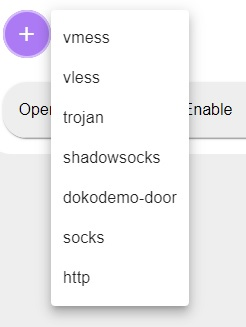

# X-View

X-View is an interface for [X-ray Core](https://github.com/XTLS/Xray-core) to make VPN configuration. This project is inspired by [x-ui](https://github.com/vaxilu/x-ui) project.


## Todos
- [ ] Add option to put vpn behind cloud
- [ ] Support multi-user
- [ ] Add data traffic monitoring
- [ ] Complete admin panel monitoring
- [ ] Traffic statistics, limit traffic, limit expiration time
- [ ] Add telegram alert
- [ ] Add reality security


# Features
- [x] Supported protocols: vmess, vless,  shadowsocks, trojan, dokodemo-door, socks, http
- [x] Support for configuring more transport configurations
- [x] Customizable xray configuration template
- [x] Supports Google Captcha v2 for login authentication (enable from admin panel)
- [x] Configure web panel port in docker-compose.yml
- [x] Multilingual
  - Persian
  - English
- [x] Support https access panel (self-provided domain name + ssl certificate)
- [x] Add certificate to nginx
- [x] Support Dark and Light Them
- [x] Add option to put vpn behind nginx

For more advanced configuration items, see Panel

 \
Easy to use menu to access different sections, change them, and language

 \
Login page supports google captcha v2

 \
Manage all inbounds

 \
Create new inbound using a user-friendly interface

 \
Supports many protocols

 \
Manage all your certificates easily

 \
Change default password

 \
Configure telegram bot for receiving alert

 \
Enable login page captcha for more security

 \
Configure nginx inside the docker, to put the inbounds behind the nginx, and load X-View secure.


# Install
```shell
wget  https://raw.githubusercontent.com/M-Ahadi/X-View/master/docker-compose.yml
```

```shell
docker-compose up -d
```

Open the web with port 4444
```
http://YOUR_IP:4444
```

In order to change the port, change value of `NGINX_PORT` in `docker-compose.yml`

# Default login
```
username: xview
password: xview
```

# Support/Donate
If you find this project helpful and you feel generous, so here are different methods you can help.

## BuyMeACoffee
[BuyMeACoffee/m.ahadi](https://www.buymeacoffee.com/m.ahadi)

## Crypto
If you want to support via crypto, these are my addresses.

### BTC
bc1qhcqtf4rqp28apanf5nvvswtmul4dlurw3qjhha


### ETH
0x5E762F19C07AFd05866c77D25669BFE8e2205731


### Tether
0x5E762F19C07AFd05866c77D25669BFE8e2205731


### Doge
DBxhcfyRYeg3z2WSCinSMbgrQ3d5NagA22


### LiteCoin
ltc1quzxlv5yt75nwttvtkc27llha6r4k8468c09tfj


### Tron
TQ4jd8aYTfohfG29Ahf7jdzZurGrR4jALV


